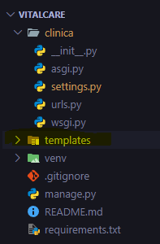
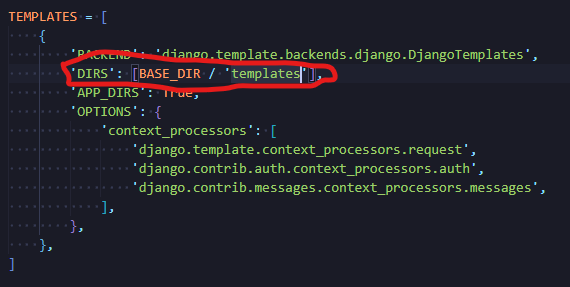
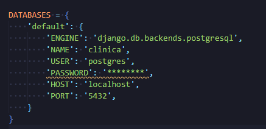
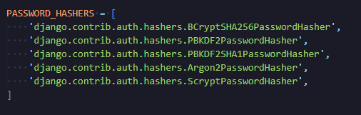
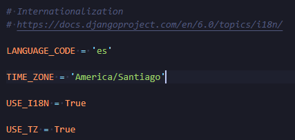

# **Paso a Paso de creación del proyecto**

## Creamos carpeta contenedora del proyecto
VitalCare

## Abrimos PowerShell y ubicamos la ruta de la carpeta
.../VitalCare

## Abrimos VSCode desde la carpeta desde PowerShell

```sh
code .
```

## Creamos un entorno virtual

```sh
python -m venv venv
```
 
## Activamos entorno virtual 

```sh
.\venv\Scripts\activate
```
## instalamos django (teniendo activado entorno virtual)
```sh
 pip install django
```

## Creamos el proyecto

```sh
django-admin startproject clinica .
```

## Instalamos el driver de conexión
```sh
pip install django psycopg2-binary
```

## Instalamos los "motores" de encriptación a utilizar en el proyecto
```sh
pip install bcrypt
```

```sh
pip install argon2-cffi
```

## Creamos archivos de dependencias (requirements.txt)
```sh
pip freeze > requirements.txt
```

## Creamos base de datos desde PostgreSQL
```sh
CREATE DATABASE clinica;
```

## Creamos la carpeta "templates" dentro de la raíz del proyecto


## Primeras configuraciones de archivo "settings.py"

### Configuramos el acceso a la carpeta "templates".


### Configuramos acceso a la base de datos.


### Incluimos PASWORD_HASHERS para su uso en encriptación.


### Camiamos idioma y zona horaria.


## Github
- Se inicializa Github
- Se pasan a stage archivos
- Primer commit
- Creación repositorio en web Github
- Sincronización de repositorios local y web

## Creamos la app "agenda" que será donde se registren las horas médicas
```sh
python manage.py startapp agenda
```

## Creamos modelos en el archivo "models.py" de la app agenda
- class Especialidad(models.Model):
- class Doctor(models.Model):
- class Paciente(models.Model):
- class Agenda(models.Model):

## Agregamos modelos al archivo "settings.py" de la app agenda
- @admin.register(Especialidad)
class EspecialidadAdmin(admin.ModelAdmin):
- @admin.register(Doctor)
class DoctorAdmin(admin.ModelAdmin):
- @admin.register(Paciente)
class PacienteAdmin(admin.ModelAdmin):
- @admin.register(Agenda)
class AgendaAdmin(admin.ModelAdmin):

### Además aquí agregamos el método de cálculo de edad a partir de la fecha de nacimiento en los modelos de doctor y paciente
```sh
    @admin.display(description='edad')
    def get_edad(self, obj):
        today = date.today()
        return today.year - obj.fecha_nacimiento.year - ((today.month, today.day) < (obj.fecha_nacimiento.month, obj.fecha_nacimiento.day))
```

### Lógica del cálculo:
- today.year - obj.fecha_nacimiento.year: Resta los años (ej: 2024 - 1990 = 34).
- La resta final (- True o - False):
- - Si hoy es 10 de marzo y tu cumpleaños es el 20 de marzo, la condición (3, 10) < (3, 20) es Verdadera (True).
- - En Python, True vale 1 y False vale 0.
- - Si aún no has cumplido años este año, resta 1 al cálculo anterior. Si ya los cumpliste, resta 0.
